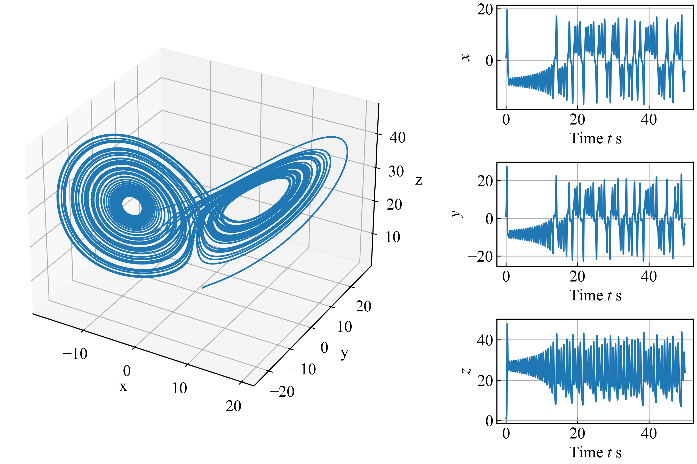

## 力学系ゼミ 第5回 プログラミング課題
### 概要
第5回は，研究で頻繁に利用するnumpyとmatplotlibを扱います．

課題を作成する際は，hw5ディレクトリ内にフォルダ(フォルダ名: `(名前)`)を作成し (e.g., `ito`)，作成したフォルダ内に課題ごとのファイルを`answer(課題番号).py`として作成してください．(e.g., `answer1.py`, `answer2-1.py`)

課題を作成する際は，必ずブランチを切り，作成したブランチ上で作業を行うようにしてください ([ブランチの作成](https://github.com/azkiphysics/team-mechanics2024?tab=readme-ov-file#ブランチの作成))．

課題が作成できたら，GitHub上でプルリクエストを開き，伊藤(ユーザー名: azkiphysics)にマージの許可を得てください．伊藤が提出した課題のコードレビューを行い，コードの修正をしていただきます．修正が完了したらマージを行い，その週の課題は終了となります．

### 課題1 (numpy)
hw3の課題3で実装したローレンツ系を記述したクラス`LorenzEnv`を`numpy`を使って書き直します．以下のテンプレートを利用して，`LorenzEnv`の`motion_equation`メソッドを`numpy`を利用して実装し，プログラムを実行して，カレントディレクトリ上に`result/trajectory.pickle`ファイルが作成されていることを確認してください．(プログラムを実行する際は，カレントディレクトリが`hw5/(名前)`にあることを確認してください．)

**テンプレート**
```python
import os
import pickle

import numpy as np


class Buffer(object):
    def __init__(self) -> None:
        self.buffer = None

    def reset(self):
        self.buffer = {}

    def push(self, data):
        for key, value in data.items():
            if key not in self.buffer:
                self.buffer[key] = []
            self.buffer[key].append(value)

    def get(self):
        return self.buffer

    def save(self, savedir, savefile):
        buffer = self.get()
        os.makedirs(savedir, exist_ok=True)
        path = os.path.join(savedir, savefile)
        with open(path, "wb") as f:
            pickle.dump(buffer, f)


class Env(object):
    def __init__(self, t_max, dt=1e-3):
        self.t_max = t_max
        self.dt = dt

        self.t = None
        self.x = None

    def integral(self, x):
        k1 = self.motion_equation(x)
        k2 = self.motion_equation(x + self.dt / 2 * k1)
        k3 = self.motion_equation(x + self.dt / 2 * k2)
        k4 = self.motion_equation(x + self.dt * k3)
        next_x = x + self.dt / 6 * (k1 + 2 * k2 + 2 * k3 + k4)
        return next_x

    def motion_equation(self, x):
        return np.zeros_like(x, dtype=np.float64)

    def reset(self, initial_t, initial_x):
        self.t = initial_t
        self.x = initial_x.copy()
        done = self.t >= self.t_max
        info = {"t": self.t, "x": self.x.copy(), "done": done}
        return info

    def step(self):
        self.t += self.dt
        self.x = self.integral(self.x)
        done = self.t >= self.t_max
        info = {"t": self.t, "x": self.x.copy(), "done": done}
        return info


class LorenzEnv(Env):
    def __init__(self, t_max, dt=1e-3, rho=28.0, sigma=10.0, beta=8.0/3.0):
        super().__init__(t_max, dt=dt)
        self.rho = rho
        self.sigma = sigma
        self.beta = beta

    def motion_equation(self, x):
        """
        numpyを使って，以下にLorenz方程式を実装してください．
        """


if __name__ == "__main__":
    t_max = 50.0
    dt = 1e-3
    initial_t = 0.0
    initial_x = np.ones(3, dtype=np.float64)

    env = LorenzEnv(t_max, dt=dt)
    buffer = Buffer()

    info = env.reset(initial_t, initial_x)
    done = info.pop("done")
    buffer.reset()
    buffer.push(info)
    while not done:
        info = env.step()
        done = info.pop("done")
        buffer.push(info)

    savedir = "result"
    savefile = "trajectory.pickle"
    buffer.save(savedir, savefile)

```

**解答例**
```python
import os
import pickle

import numpy as np


class Buffer(object):
    def __init__(self) -> None:
        self.buffer = None

    def reset(self):
        self.buffer = {}

    def push(self, data):
        for key, value in data.items():
            if key not in self.buffer:
                self.buffer[key] = []
            self.buffer[key].append(value)

    def get(self):
        return self.buffer

    def save(self, savedir, savefile):
        buffer = self.get()
        os.makedirs(savedir, exist_ok=True)
        path = os.path.join(savedir, savefile)
        with open(path, "wb") as f:
            pickle.dump(buffer, f)


class Env(object):
    def __init__(self, t_max, dt=1e-3):
        self.t_max = t_max
        self.dt = dt

        self.t = None
        self.x = None

    def integral(self, x):
        k1 = self.motion_equation(x)
        k2 = self.motion_equation(x + self.dt / 2 * k1)
        k3 = self.motion_equation(x + self.dt / 2 * k2)
        k4 = self.motion_equation(x + self.dt * k3)
        next_x = x + self.dt / 6 * (k1 + 2 * k2 + 2 * k3 + k4)
        return next_x

    def motion_equation(self, x):
        return np.zeros_like(x, dtype=np.float64)

    def reset(self, initial_t, initial_x):
        self.t = initial_t
        self.x = initial_x.copy()
        done = self.t >= self.t_max
        info = {"t": self.t, "x": self.x.copy(), "done": done}
        return info

    def step(self):
        self.t += self.dt
        self.x = self.integral(self.x)
        done = self.t >= self.t_max
        info = {"t": self.t, "x": self.x.copy(), "done": done}
        return info


class LorenzEnv(Env):
    def __init__(self, t_max, dt=1e-3, rho=28.0, sigma=10.0, beta=8.0/3.0):
        super().__init__(t_max, dt=dt)
        self.rho = rho
        self.sigma = sigma
        self.beta = beta

    def motion_equation(self, x):
        dx_dt = np.zeros_like(x, dtype=np.float64)
        dx_dt[0] = self.sigma * (x[1] - x[0])
        dx_dt[1] = x[0] * (self.rho - x[2]) - x[1]
        dx_dt[2] = x[0] * x[1] - self.beta * x[2]
        return dx_dt


if __name__ == "__main__":
    t_max = 50.0
    dt = 1e-3
    initial_t = 0.0
    initial_x = np.ones(3, dtype=np.float64)

    env = LorenzEnv(t_max, dt=dt)
    buffer = Buffer()

    info = env.reset(initial_t, initial_x)
    done = info.pop("done")
    buffer.reset()
    buffer.push(info)
    while not done:
        info = env.step()
        done = info.pop("done")
        buffer.push(info)

    savedir = "result"
    savefile = "trajectory.pickle"
    buffer.save(savedir, savefile)

```

### 課題2 (matplotlib)
以下のソースコードを利用して，課題1で得られたシミュレーション結果の図を作成してください．(プログラムを実行する際は必ずカレントディレクトリが`hw5/(名前)`であることを確認してください．)


```python
import os
import pickle

import matplotlib.pyplot as plt
import numpy as np


# Matplotlibで綺麗な論文用のグラフを作る
# https://qiita.com/MENDY/items/fe9b0c50383d8b2fd919
plt.rcParams['font.family'] = 'Times New Roman' # font familyの設定
plt.rcParams['mathtext.fontset'] = 'stix' # math fontの設定
plt.rcParams["font.size"] = 15 # 全体のフォントサイズが変更されます。
plt.rcParams['xtick.labelsize'] = 15 # 軸だけ変更されます。
plt.rcParams['ytick.labelsize'] = 15 # 軸だけ変更されます
plt.rcParams['xtick.direction'] = 'in' # x axis in
plt.rcParams['ytick.direction'] = 'in' # y axis in 
plt.rcParams['axes.linewidth'] = 1.0 # axis line width
plt.rcParams['axes.grid'] = True # make grid


if __name__ == "__main__":
    loaddir = "result"
    loadfile = "trajectory.pickle"
    loadpath = os.path.join(loaddir, loadfile)
    with open(loadpath, "rb") as f:
        result = pickle.load(f)

    t = result["t"]
    x, y, z = np.split(np.vstack(result["x"]), 3, axis=1)

    fig = plt.figure(figsize=(9, 6), layout="constrained")
    axs = fig.subplot_mosaic(
        [
            ["trajectory", "time_series_x"],
            ["trajectory", "time_series_y"],
            ["trajectory", "time_series_z"],
        ],
        per_subplot_kw={("trajectory",): {"projection": "3d"}},
        gridspec_kw={"width_ratios": [2, 1], "wspace": 0.15, "hspace": 0.05},
    )
    axs["trajectory"].plot(x, y, z)
    axs["trajectory"].set_xlabel("x")
    axs["trajectory"].set_ylabel("y")
    axs["trajectory"].set_zlabel("z")

    axs["time_series_x"].plot(t, x)
    axs["time_series_x"].set_xlabel("Time $t$ s")
    axs["time_series_x"].set_ylabel("$x$")

    axs["time_series_y"].plot(t, y)
    axs["time_series_y"].set_xlabel("Time $t$ s")
    axs["time_series_y"].set_ylabel("$y$")

    axs["time_series_z"].plot(t, z)
    axs["time_series_z"].set_xlabel("Time $t$ s")
    axs["time_series_z"].set_ylabel("$z$")

    savedir = loaddir
    savefile = "trajectory.png"
    savepath = os.path.join(savedir, savefile)
    fig.savefig(savepath, dpi=300)
    plt.close()
```

プログラムを実行すると次の図が`result`ディレクトリに出力されます．


