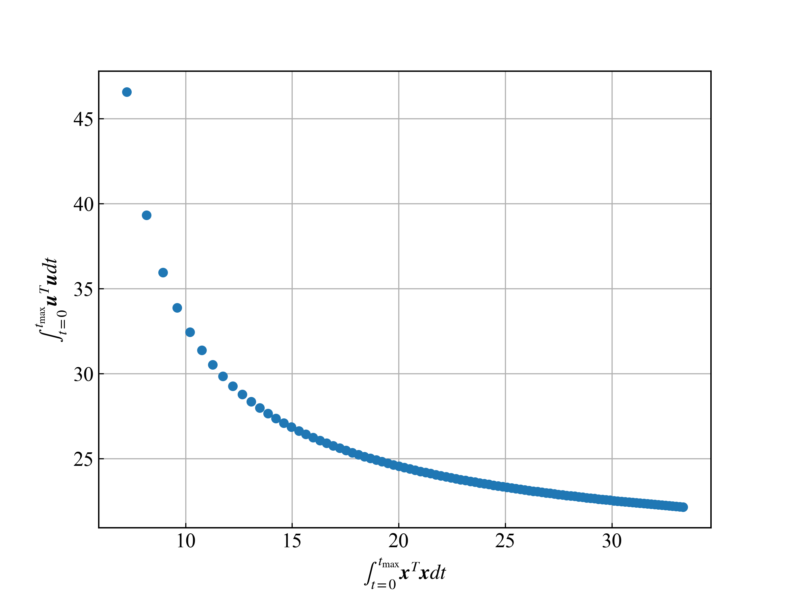

## 力学系ゼミ 第7回 プログラミング課題
### 概要
第7回は，第6回で実装した倒立振子環境(`CartPoleEnv`)を用いて，現代制御の一つであるLQR制御により, カート上のポールの倒立状態を維持するという課題を行います．

課題を作成する際は，hw7ディレクトリ内にフォルダ(フォルダ名: `(名前)`)を作成し (e.g., `ito`)，作成したフォルダ内に課題ごとのファイルを`answer(課題番号).py`として作成してください．(e.g., `answer1.py`, `answer2-1.py`)

課題を作成する際は，必ずブランチを切り，作成したブランチ上で作業を行うようにしてください ([ブランチの作成](https://github.com/azkiphysics/team-mechanics2024?tab=readme-ov-file#ブランチの作成))．

課題が作成できたら，GitHub上でプルリクエストを開き，伊藤(ユーザー名: azkiphysics)にマージの許可を得てください．伊藤が提出した課題のコードレビューを行い，コードの修正をしていただきます．修正が完了したらマージを行い，その週の課題は終了となります．([プルリクエストの作成](https://github.com/azkiphysics/team-mechanics2024?tab=readme-ov-file#プルリクエストの作成))

### 準備
今回と次回で使用するライブラリのインストールを行います．以下のコマンドを入力して`pyyaml`, `tqdm`, `pytorch`ライブラリをインストールしてください．

```zsh
conda install pyyaml tqdm
conda install pytorch torchvision torchaudio cpuonly -c pytorch
```

もし，お使いのPCに`GeForce`のグラボが搭載されている場合は，上記2行目のコマンドを以下のように書き換えてください．

```zsh
conda install pytorch torchvision torchaudio pytorch-cuda=12.1 -c pytorch -c nvidia # CUDA12.1の場合のコマンド．CUDA 11.8の場合は12.1を11.8に変更する．
```

### 課題1 (倒立振子のLQR制御)
課題1では，LQR制御により倒立振子環境の倒立維持を行います．`common/agents.py`の`LQRAgent.reset`メソッド内でRicacci代数方程式を解くコードを実装し，以下のコマンドをご自身が作成したディレクトリ上で実行してください．

```zsh
python answer1.py configs/CartPoleEnv/LQR.yaml
```

プログラムをコマンドプロンプトから実行すると，`results/CartPoleEnv/LQR/evaluate`ディレクトリ内に結果が保存されているので制御が上手くいったか確認してください．上手くいくと，下図のような図が得られていると思います．


### 課題2 (LQR制御のパレート解)
課題2では，LQR制御の目的関数内の係数行列 $\mathrm{Q}$ と $\mathrm{R}$ を変えた時の制御結果について調べます．

ここでは, $Q = 1.0$ で固定して $R$ を $0.1\sim 10.0$ まで $0.1$ 刻みで変化させ最適化を行います．そして，最適化後の目的関数の第1項と第2項の値を図にプロットします．

以下のコマンドをご自身が作成したディレクトリ上で実行してください．

```zsh
python answer1.py configs/CartPoleEnv/LQR.yaml
```

プログラムをコマンドプロンプトから実行すると，全ての条件で最適化が行われ，`results/CartPoleEnv/LQR`内にパレート解の結果が`pareto_optimal_solution.png`という図に出力されます (下図)．



上図から，LQR制御の最適結果が今回の多目的最適化問題のパレートフロントとなっていることが確認できます．

### 解説
#### 非線形運動方程式の線形化
LQR制御では，線形な運動方程式を利用します．そこで，倒立振子環境を平衡点まわりで線形化することを考えます．いま，倒立振子の独立変数を $\boldsymbol{x}$ とし，平衡点を $\boldsymbol{x}\_e$ , $\boldsymbol{u}\_e$ とします． 独立変数 $\boldsymbol{x}$ に対する運動方程式を $\dot{\boldsymbol{x}} = \boldsymbol{f}(\boldsymbol{x})$ としたとき， $\boldsymbol{x} = \boldsymbol{x}\_e$ , $\boldsymbol{u}=\boldsymbol{u}\_e$ まわりでテイラー展開すると次式のように表されます．

$$
\frac{d}{dt}(\boldsymbol{x} - \boldsymbol{x}\_e) = \frac{\partial \boldsymbol{f}}{\partial \boldsymbol{x}}\Bigg |\_{(\boldsymbol{x}\_e, \boldsymbol{u}\_e)}(\boldsymbol{x} - \boldsymbol{x}\_e) + \frac{\partial \boldsymbol{f}}{\partial \boldsymbol{u}}\Bigg|\_{(\boldsymbol{x}\_e, \boldsymbol{u}\_e)}(\boldsymbol{u} - \boldsymbol{u}\_e)
$$

$\bar{\boldsymbol{x}} = \boldsymbol{x} - \boldsymbol{x}\_e$ , $\bar{\boldsymbol{u}} = \boldsymbol{u} - \boldsymbol{u}\_e$ , $\mathrm{A} = \frac{\partial \boldsymbol{f}}{\partial \boldsymbol{x}}\big|\_{(\boldsymbol{x}\_e, \boldsymbol{u}\_e)}$ , $\mathrm{B} = \frac{\partial \boldsymbol{f}}{\partial \boldsymbol{u}}\big|\_{(\boldsymbol{x}\_e, \boldsymbol{u}\_e)}$ とすると，以下のような線形方程式に書き換えることができます．

$$
\dot{\bar{\boldsymbol{x}}} = \mathrm{A}\bar{\boldsymbol{x}} + \mathrm{B}\bar{\boldsymbol{u}}
$$

#### 倒立振子の運動方程式の線形化
上記の方法を用いて，倒立振子の運動方程式を線形化します．`hw6`では，拡大法を用いて運動方程式の定式化を行いましたが，ここでは消去法を利用して独立変数 $\boldsymbol{q}\_{i}$ に関する運動方程式の定式化を行い，運動方程式の線形化を行います．

教科書「マルチボディダイナミクス」の10.2.2項に詳しい説明がありますので，ここでは消去法により求めた運動方程式を以下に記載しておきます．倒立振子の独立変数 $\boldsymbol{q}\_{i}$ には，カートの位置 $x_{\mathrm{cart}}$ , ポールの角度 $\theta_{\mathrm{pole}}$ を設定しています．

$$
\mathrm{M}^I\ddot{\boldsymbol{q}}_I = \boldsymbol{Q}^I
$$

各変数の意味については教科書の10.2.2項を参考にしてください．上式を用いて状態方程式を定義すると以下のようになります．

$$
\frac{d}{dt}\begin{bmatrix}
    \boldsymbol{q}^I\\
    \dot{\boldsymbol{q}}^I
\end{bmatrix} = \begin{bmatrix}
    \dot{\boldsymbol{q}}^I\\
    M^{-1}\boldsymbol{Q}^I
\end{bmatrix}
$$

上式を平衡点 $[{\boldsymbol{q}^I_e}^T, {\dot{\boldsymbol{q}}^I_e}^T] = [1.0, \pi/2, 0.0, 0.0]^T$ 周りで線形化して線形運動方程式を求めます．本シミュレーションでは，行列 $\mathrm{A}$ , $\mathrm{B}$ はそれぞれ数値的に計算して導出しています．シミュレーションでは，この線形運動方程式を利用してLQR制御を行います．

#### LQR制御
LQR制御では，以下の目的関数を最小にするように制御入力を決定します．ここで, $\mathrm{Q}$ , $\mathrm{Q}_f$ は半正定値対角行列, $\mathrm{R}$ は正定値対角行列を表します．

$$
J = \int_{t=0}^{t_{\mathrm{max}}}\frac{1}{2}\Big(\bar{\boldsymbol{x}}^T\mathrm{Q}\bar{\boldsymbol{x}} + \bar{\boldsymbol{u}}^T\mathrm{R}\bar{\boldsymbol{u}}\Big)dt + \frac{1}{2}\bar{\boldsymbol{x}}(t_f)^T\mathrm{Q}_f\bar{\boldsymbol{x}}(t_f)
$$

ここでは，線型方程式 $\dot{\bar{\boldsymbol{x}}} = \mathrm{A}\bar{\boldsymbol{x}} + \mathrm{B}\bar{\boldsymbol{u}}$ を制約条件として, 目的関数 $J$ を最小化するので，実際には以下の目的関数 $J_{\mathrm{aug}}$ を最小化します．ここで，変数 $\boldsymbol{\lambda}$ はラグランジュの未定乗数を表しており，下式の右辺第1項の被積分関数に $\boldsymbol{\lambda}^T(\mathrm{A}\bar{\boldsymbol{x}} + \mathrm{B}\bar{\boldsymbol{u}} - \dot{\bar{\boldsymbol{x}}})$ を加えることで，運動制約を考慮した最適化が可能となります．

$$
J_{\mathrm{aug}} = \int_{t=0}^{t_{\mathrm{max}}}\Bigg\\{\frac{1}{2}\Big(\bar{\boldsymbol{x}}^T\mathrm{Q}\bar{\boldsymbol{x}} + \bar{\boldsymbol{u}}^T\mathrm{R}\bar{\boldsymbol{u}}\Big) + \boldsymbol{\lambda}^T(\mathrm{A}\bar{\boldsymbol{x}} + \mathrm{B}\bar{\boldsymbol{u}} - \dot{\bar{\boldsymbol{x}}})\Bigg\\}dt + \frac{1}{2}\bar{\boldsymbol{x}}(t_f)^T\mathrm{Q}_f\bar{\boldsymbol{x}}(t_f)
$$

目的関数 $J_{\mathrm{aug}}$ を最小にするための必要条件は，変分 $\delta J_{\mathrm{aug}}$ がゼロになることです．そこで，変分 $\delta J_{\mathrm{aug}}$ を計算すると

$$
\begin{eqnarray}
    \delta J_{\mathrm{aug}} &=& \int_{t=0}^{t_{\mathrm{max}}}\Bigg\\{\Big(\bar{\boldsymbol{x}}^T\mathrm{Q}\delta\bar{\boldsymbol{x}} + \bar{\boldsymbol{u}}^T\mathrm{R}\delta\bar{\boldsymbol{u}}\Big) + \delta\boldsymbol{\lambda}^T(\mathrm{A}\bar{\boldsymbol{x}} + \mathrm{B}\bar{\boldsymbol{u}} - \dot{\bar{\boldsymbol{x}}}) + \boldsymbol{\lambda}^T(\mathrm{A}\delta\bar{\boldsymbol{x}} + \mathrm{B}\delta\bar{\boldsymbol{u}} - \delta\dot{\bar{\boldsymbol{x}}})\Bigg\\}dt + \bar{\boldsymbol{x}}(t_f)^T\mathrm{Q}\_f\delta\bar{\boldsymbol{x}}(t_f)\\
    &=& \int_{t=0}^{t_{\mathrm{max}}}\Big\\{(\bar{\boldsymbol{x}}^T\mathrm{Q} + \boldsymbol{\lambda}^T\mathrm{A} + \dot{\boldsymbol{\lambda}}^T)\delta\bar{\boldsymbol{x}} + (\bar{\boldsymbol{u}}^T\mathrm{R} + \boldsymbol{\lambda}^T\mathrm{B})\delta\bar{\boldsymbol{u}} + (\mathrm{A}\bar{\boldsymbol{x}} + \mathrm{B}\bar{\boldsymbol{u}}  - \dot{\bar{\boldsymbol{x}}})^T\delta\boldsymbol{\lambda}\Big\\}dt + \Big\\{\bar{\boldsymbol{x}}(t_f)^T\mathrm{Q}_f - \boldsymbol{\lambda}^T(t_f)\Big\\}\delta\bar{\boldsymbol{x}}(t_f)
\end{eqnarray}
$$

となるので, $\delta J_{\mathrm{aug}} = 0$ となるための条件は以下のようになります．

$$
\begin{cases}
    \bar{\boldsymbol{x}}^T\mathrm{Q} + \boldsymbol{\lambda}^T\mathrm{A} + \dot{\boldsymbol{\lambda}}^T = \boldsymbol{0}\\
    \bar{\boldsymbol{u}}^T\mathrm{R} + \boldsymbol{\lambda}^T\mathrm{B} = \boldsymbol{0}\\
    \dot{\bar{\boldsymbol{x}}} = \mathrm{A}\bar{\boldsymbol{x}} + \mathrm{B}\bar{\boldsymbol{u}}\\
    \bar{\boldsymbol{x}}(t_f)^T\mathrm{Q}_f - \boldsymbol{\lambda}^T(t_f) = \boldsymbol{0}
\end{cases}
$$

これより，上式は初期条件 $\boldsymbol{x}(t_0) = \boldsymbol{x}_0$ , 終端条件 $\boldsymbol{\lambda}(t_f) = \mathrm{Q}_f\bar{\boldsymbol{x}}(t_f)$ の2点境界値問題として数値的に解くことができます．

また，終端条件を参考にして $\boldsymbol{\lambda} = \mathrm{P}\bar{\boldsymbol{x}}$ と仮定します．このとき，これと3つ目の式を1つ目の式に代入すると，以下のように書き直すことができます．

$$
\dot{\mathrm{P}}\bar{\boldsymbol{x}} + \mathrm{P}(\mathrm{A}\bar{\boldsymbol{x}} + \mathrm{B}\bar{\boldsymbol{u}}) + \mathrm{Q}\bar{\boldsymbol{x}} + \mathrm{A}^T\mathrm{P}\bar{\boldsymbol{x}} = \boldsymbol{0}
$$

さらに，第2式を $\bar{\boldsymbol{u}}$ について解くと, $\bar{\boldsymbol{u}} = -\mathrm{R}^{-1}\mathrm{B}^T\mathrm{P}\bar{\boldsymbol{x}}$ となるので，これを上式に代入すると，以下の方程式が得られます．

$$
\dot{\mathrm{P}}\bar{\boldsymbol{x}} + \mathrm{P}\mathrm{A}\bar{\boldsymbol{x}} + \mathrm{A}^T\mathrm{P}\bar{\boldsymbol{x}} - \mathrm{P}\mathrm{B}\mathrm{R}^{-1}\mathrm{B}^T\mathrm{P}\bar{\boldsymbol{x}} + \mathrm{Q}\bar{\boldsymbol{x}} = \boldsymbol{0}
$$

この式は任意の $\bar{\boldsymbol{x}}$ について成り立つので， $\bar{\boldsymbol{x}}$ を除いた以下の行列方程式の形で表されます．

$$
\dot{\mathrm{P}} + \mathrm{P}\mathrm{A} + \mathrm{A}^T\mathrm{P} - \mathrm{P}\mathrm{B}\mathrm{R}^{-1}\mathrm{B}^T\mathrm{P} + \mathrm{Q} = \boldsymbol{0}
$$

この方程式はRicacci方程式と呼ばれており，終端条件を $\mathrm{P} = \mathrm{S}\_f$ として時間前方積分をしてあげることで，各時刻の $\mathrm{P}$ が計算でき，制御入力 $\bar{\boldsymbol{u}}$ を計算することができます．ここで，目的関数 $J_{\mathrm{aug}}$ の終端コストを無くし, $t_{\mathrm{max}}\rightarrow\infty$ とした場合, $\dot{\mathrm{P}}$ の項が消え，以下のようになります．

$$
\mathrm{P}\mathrm{A} + \mathrm{A}^T\mathrm{P} - \mathrm{P}\mathrm{B}\mathrm{R}^{-1}\mathrm{B}^T\mathrm{P} + \mathrm{Q} = \boldsymbol{0}
$$

この方程式はRicacci代数方程式と呼ばれ，上式を解くことで制御入力 $\bar{\boldsymbol{u}}$ が計算できます．

上記のRicacci代数方程式には2通りの解法があります．1つ目は $P$ に適当な初期値を与え，Ricacci方程式を $\dot{P}$ がゼロになるまで繰り返し解く方法，2つ目は有本-ポッターの方法を利用して解く方法です．以下では後者の有本-ポッターの方法を利用して解く方法について説明します．

最適制御下の運動方程式( $x$ に関する微分方程式)と随伴方程式( $\lambda$ に関する微分方程式)をまとめた正準方程式は以下のように書くことができます．

$$
\frac{d}{dt}\begin{bmatrix}
    \bar{\boldsymbol{x}}\\
    \boldsymbol{\lambda}
\end{bmatrix} = \begin{bmatrix}
    \mathrm{A} & -\mathrm{BR^{-1}B^T}\\
    -\mathrm{Q} & -\mathrm{A}
\end{bmatrix}\begin{bmatrix}
    \bar{\boldsymbol{x}}\\
    \boldsymbol{\lambda}
\end{bmatrix} = \mathrm{A}_H\begin{bmatrix}
    \bar{\boldsymbol{x}}\\
    \boldsymbol{\lambda}
\end{bmatrix}
$$

$\mathrm{A}_H$ をハミルトニアン行列と言います．ハミルトニアン行列の性質として, $n$ 個の安定な固有値と $n$ 個の不安定な固有値を持つことが知られています (証明は[こちら](https://stlab.ssi.ist.hokudai.ac.jp/~yuhyama/lecture/digital/digi-part2.pdf)のp.53をご確認ください)．上記の正準方程式が漸近安定であるための条件は，正準方程式系がハミルトニアン行列 $\mathrm{A}_H$ の安定な固有値に対応する $n$ 次元の固有ベクトル空間に制約されたダイナミクスであることですが，これは $\boldsymbol{\lambda} = \mathrm{P}\bar{\boldsymbol{x}}$ という条件により満たされています．そこで, $\mathrm{A}_H$ の安定な固有値に対応する固有ベクトル空間を，安定な固有値で構成された行列 $\mathrm{\Lambda}$ とそれに対応する固有ベクトル行列 $\Big[\mathrm{S}_1^T, \mathrm{S}_2^T\Big]^T$ を用いて， 

$$
\mathrm{A}_H\begin{bmatrix}
    \mathrm{S}_1\\
    \mathrm{S}_2
\end{bmatrix} = \begin{bmatrix}
    \mathrm{S}_1\\
    \mathrm{S}_2
\end{bmatrix}\boldsymbol{\Lambda}
$$

と表すと, $[\bar{\boldsymbol{x}}^T, \boldsymbol{\lambda}^T]$ は係数ベクトル $\boldsymbol{k}$ を用いて以下のように表すことができます．

$$
\begin{bmatrix}
    \bar{\boldsymbol{x}}\\
    \boldsymbol{\lambda}
\end{bmatrix} = \begin{bmatrix}
    \bar{\boldsymbol{x}}\\
    \mathrm{P}\bar{\boldsymbol{x}}
\end{bmatrix} = \begin{bmatrix}
    \mathrm{S}_1\\
    \mathrm{S}_2
\end{bmatrix}\boldsymbol{k}
$$

以上より，行列 $\mathrm{P}$ は $\mathrm{P} = \mathrm{S}_2\mathrm{S}_1^{-1}$ となります．

