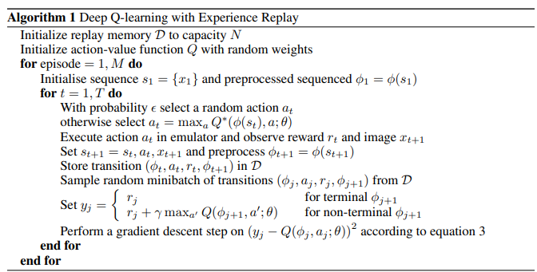

## 力学系ゼミ 第8回 プログラミング課題
### 概要
第8回は，第7回で実装した倒立振子環境(`CartPoleEnv`)を用いて，機械学習手法の一つである深層強化学習により, カート上のポールの倒立状態を目標地点で維持するという課題を行います．

課題を作成する際は，hw8ディレクトリ内にフォルダ(フォルダ名: `(名前)`)を作成し (e.g., `ito`)，作成したフォルダ内に課題ごとのファイルを`answer(課題番号).py`として作成してください．(e.g., `answer1.py`, `answer2-1.py`)

課題を作成する際は，必ずブランチを切り，作成したブランチ上で作業を行うようにしてください ([ブランチの作成](https://github.com/azkiphysics/team-mechanics2024?tab=readme-ov-file#ブランチの作成))．

課題が作成できたら，GitHub上でプルリクエストを開き，伊藤(ユーザー名: azkiphysics)にマージの許可を得てください．伊藤が提出した課題のコードレビューを行い，コードの修正をしていただきます．修正が完了したらマージを行い，その週の課題は終了となります．([プルリクエストの作成](https://github.com/azkiphysics/team-mechanics2024?tab=readme-ov-file#プルリクエストの作成))

### 準備
#### ライブラリのインストール
今回使用するライブラリのインストールを行います．以下のコマンドを入力して`pytorch`ライブラリをインストールしてください．

```zsh
conda install pytorch torchvision torchaudio cpuonly -c pytorch
```

もし，お使いのPCに`GeForce`のグラボが搭載されている場合は，上記2行目のコマンドを以下のように書き換えてください．

```zsh
conda install pytorch torchvision torchaudio pytorch-cuda=12.1 -c pytorch -c nvidia # CUDA12.1の場合のコマンド．CUDA 11.8の場合は12.1を11.8に変更する．
```

#### テンプレートのコピー&ペースト
ご自身で作成したディレクトリに`templates`内のファイルとフォルダをコピー&ペーストしてください．ファイルの構成はそのままでコピペするようにしてください．(ファイル名を変えるとエラーがでます．)

コピペ後のファイルの構成が以下のようになっていれば問題ありません．

```
hw8
├── README.md
...
└── (ご自身で作成したディレクトリ)
    ├── common
    |   ├── agents.py
    |   ├── buffers.py
    |   ├── envs.py
    |   ├── utils.py
    |   └── wrappers.py
    ├── configs
    |   ├── CartPoleEnv
    |   |   ├── DDPG.yaml
    |   |   └── TD3.yaml
    |   └── gym
    |       ├── CartPole-v1
    |       |   └── DQN.yaml
    |       └── Pendulum-v1
    |           ├── DDPG.yaml
    |           └── TD3.yaml
    └── answer.py
```

#### プログラム実行時の注意点
プログラムを実行する場合は，必ずご自身のディレクトリに移動してください．相対パスでモジュールをインポートしているため，別のディレクトリからプログラムを実行すると，エラーが出る可能性があります．

カレントディレクトリが`team-mechanics2024`の場合は以下のコマンドを実行すると，カレントディレクトリを移動できます．

**Windowsの場合**

```zsh
cd hw8\(ご自身で作成したディレクトリ)
```

**Mac/Linuxの場合**

```zsh
cd hw8/(ご自身で作成したディレクトリ)
```

### 課題1 (DQNによる倒立振子制御)
課題1では，DQNを用いて倒立振子を $x_{\mathrm{cart}} = 1.0$ に維持するという制御を行います．ご自身が作成したディレクトリ上で以下のコマンドを実行してください．

```zsh
python answer.py configs/CartPoleEnv/Balance/DQN.yaml
```

### 課題2 (DDPGによる倒立振子制御)
課題2では，DDPGを用いて倒立振子を $x_{\mathrm{cart}} = 1.0$ に維持するという制御を行います．ご自身が作成したディレクトリ上で以下のコマンドを実行してください．

```zsh
python answer.py configs/CartPoleEnv/Balance/DDPG.yaml
```

### 課題3 (TD3による倒立振子制御)
課題2では，TD3を用いて倒立振子を $x_{\mathrm{cart}} = 1.0$ に維持するという制御を行います．ご自身が作成したディレクトリ上で以下のコマンドを実行してください．

```zsh
python answer.py configs/CartPoleEnv/Balance/TD3.yaml
```

### 課題4 (LQR制御と強化学習による制御の比較)
課題1~3で得られた結果とhw7で得られた結果を比較して，LQR制御と強化学習で制御結果にどのような違いがあるか考察してください．

### おまけ課題 (TD3によるCartPoleの振り上げ制御)
本課題では，下にある状態( $\theta_{\mathrm{poll}} = -\pi/2$ )の棒を振り上げて $x_{\mathrm{cart}} = 1.0$ に維持するという制御を行います．ご自身が作成したディレクトリ上で以下のコマンドを実行してください．

```zsh
python answer.py configs/CartPoleEnv/SwingUp/TD3.yaml
```

### 解説
#### 強化学習とは
強化学習は機械学習の手法の一つで，環境との相互作用を通して得られるデータを利用してモデルを作成します．

下図は強化学習の概念図を示しています．強化学習の構成要素として，環境とエージェントがあります．
環境は，エージェントの状態遷移確率と報酬が定義されたシステムを表しています．ロボットの制御では，一般に力学系が環境に当たります．
エージェントは環境から受け取った状態から行動を決定するシステムを表しており，ロボットの制御では，制御器がエージェントに当たります．
環境とエージェントは下図のように状態・報酬と行動を交互に受け渡すような相互作用を行います．この時，エージェントが環境から受け取る報酬の総和 (=リターン)を最大にするようにエージェントの行動を最適化する手法が強化学習です．

#### 状態 $s$ と観測 $o$
状態変数のとことを強化学習では状態と呼び $s$ で表します．また，エージェントが観測できる状態のことを，観測と呼び $o$ で表します．観測 $o$ は状態 $s$ を完全に観測できる場合もあれば，一部だけ観測できる場合もあります．

#### 行動 $a$
エージェントの行動は環境によってさまざま定義することができます．例えば，Atariのようなゲーム環境の場合，行動空間は離散的になり, 行動 $a$ は0以上の整数で表すことができます．一方，倒立振子環境の場合，行動空間は連続的になり，行動 $a$ は実数ベクトルで表すことができます．

#### 方策 $\pi$
方策は，エージェントが取るべき行動を決定する規則を表します．方策は状態 $s$ の関数として $\mu$ もしくは $\pi$ で表されます. 方策には決定論的な方策と確率的な方策があります．決定論的な方策の場合，行動 $a$ は状態 $s$ を用いて次式で定義されます．

$$
a = \mu(s).
$$

確率的な方策の場合, 行動 $a$ は状態 $s$ を用いて次式で定義されます．

$$
a\sim\pi(\cdot|s).
$$

深層強化学習では，方策 $\pi$ のパラメータを $\theta$ や $\phi$ を用いて表します．方策を $\theta$ で表す場合，方策は次のように表すことができます．

$$
a = \mu_\theta(s).
$$

$$
a \sim \pi_\theta(\cdot|s).
$$


#### 軌道 $\tau$
軌道 $\tau$ は環境とエージェントの相互作用によって得られる状態-行動系列のことを指し，以下のように表します．

$$
\tau = (s_0, a_0, s_1, a_1, ...).
$$

ここで，初期状態 $s_0$ は初期状態分布 $\rho_0$ に従ってランダムサンプリングされます．

$$
s_0\sim\rho_0(\cdot).
$$

また，各時刻における状態遷移は環境の法則に従って決定論的，もしくは確率的に行われます．状態遷移が決定論的に行われる場合，次の時刻の状態 $s_{k+1}$ は 関数 $f$ を用いて以下のように表されます．

$$
s_{k + 1} = f(s_k, a_k).
$$

状態遷移が確率的に行われる場合, 次の時刻の状態 $s_{k+1}$ は確率分布 $P$ を用いて以下のように表されます．

$$
s_{k + 1} \sim P(\cdot|s_k, a_k).
$$

#### 報酬 $r$ とリターン $G$
強化学習では，方策を最適化するための信号として報酬を利用します．報酬とはエージェントの行動の良し悪しをスカラー値で表したものになります．時刻 $k$ における報酬 $r_k$ は一般に時刻 $k$ における状態 $s_k$ , 行動 $a_k$ と 時刻 $k+1$ における状態 $s_{k+1}$ の関数として以下のように定義することができます．

$$
r_k = r(s_k, a_k, s_{k+1})
$$

エージェントの目標はエージェントが軌道 $\tau$ に沿って状態遷移した時に環境から受け取る報酬の累積和を最大にすることです．報酬の累積和のことをリターンと呼び, $G(\tau)$ で表します．

リターン $G(\tau)$ にはいくつか定義式が存在します．1つ目は有限区間累積報酬和であり，次式で定義されます．

$$
G(\tau) = \sum_{k=0}^Tr_k.
$$

2つ目は無限区間割引報酬和であり，各時刻の報酬に割引率 $\gamma\in(0, 1)$ の累乗 $\gamma^k$ をかけて次式のように定義します．

$$
G(\tau) = \sum_{k=0}^{\infty}\gamma^kr_k.
$$

#### 強化学習の問題設定
強化学習の目標をより正確に説明すると，「方策に応じて決定される行動系列を選択した時に得られるリターンの期待値を最大にするような方策を選ぶ」となります．

リターンの期待値について考えるために，ここでは，状態遷移が確率的に行われるものとします．この場合, $T$ ステップまでの軌道 $\tau = (s_0, a_0, ..., s_{T-1}, a_{T-1}, s_T)$ の確率は次のようになります．

$$
P(\tau|\pi) = \rho_0(s_0)\Pi_{k=0}^{T-1}P(s_{k+1}|s_k, a_k)\pi(a_k|s_k).
$$

この時，リターンの期待値 $J(\pi)$ は次式で表されます．

$$
J(\pi) = \int_{\tau}P(\tau|\pi)G(\tau) = \mathbb{E}_{\tau\sim\pi}[G(\tau)].
$$

これより，強化学習の目標を式で表すと以下のように書くことができます. $\pi^\ast$ は最適方策と呼ばれます．

$$
\pi^\ast = \arg\max_{\pi}J(\pi).
$$

#### 価値関数と行動価値関数
ある状態が与えられた場合やある状態-行動ペアが与えられた場合の価値を知ることは，最適方策を求める上でしばしば有用です．ここで，価値とはある状態もしくは状態-行動ペアから初めて，特定の方策に従って得られる行動系列に沿って状態遷移した時のリターンの期待値のことを指します．特に, ある状態が与えられた時の価値を価値関数と呼び，ある状態-行動ペアが与えられた時の価値を行動価値関数と呼びます．

価値関数, 行動価値関数にはそれぞれオンポリシー関数と最適関数の2種類存在します．オンポリシーな価値関数と行動価値関数は方策 $\pi$ に従って得られる行動系列に沿って状態遷移した時のリターンの期待値を指し，それぞれ以下のように表されます．

$$
V^\pi(s) = \mathbb{E}_{\tau\sim\pi}[G(\tau) | s_0 = s].
$$

$$
Q^\pi(s, a) = \mathbb{E}_{\tau\sim\pi}[G(\tau) | s_0 = s, a_0 = a].
$$

一方，最適な価値関数と行動価値関数は最適方策 $\pi^\ast$ に従って得られる行動系列に沿って状態遷移した時のリターンの期待値を指し，それぞれ以下のように表されます．

$$
V^\ast(s) = \max_{\pi}\mathbb{E}_{\tau\sim\pi}[G(\tau) | s_0 = s].
$$

$$
Q^\ast(s, a) = \max_{\pi}\mathbb{E}_{\tau\sim\pi}[G(\tau) | s_0 = s, a_0 = a].
$$

ここで，価値関数 $V^\pi$ , $V^\ast$ と行動価値関数 $Q^\pi$ , $Q^\ast$ の間には次の関係式が成り立ちます．

$$
V^\pi(s) = \mathbb{E}_{a\sim\pi}[Q^\pi(s, a)].
$$

$$
V^\ast(s) = \max_{a}Q^\ast(s, a).
$$

#### 最適行動価値関数と最適行動
最適行動価値関数 $Q^\ast(s, a)$ は定義より，ある状態 $s$ から始めて行動 $a$ を取った時のリターンの期待値を表します. 一方，状態 $s$ における最適方策は状態 $s$ から始めてリターンの期待値が最大になるような行動を選択します．結果として，最適行動 $a^\ast$ は最適行動価値関数 $Q^\ast(s, a)$ から直接求めることができ，以下のようになります．

$$
a^\ast(s) = \arg\max_{a}Q^\ast(s, a).
$$

#### ベルマン方程式
オンポリシーな価値関数 $V^\pi(s)$ と行動価値関数 $Q^\pi(s, a)$ はそれぞれ次のように変形することができます．

$$
\begin{eqnarray}
    V^\pi(s) &=& \mathbb{E}_{\tau\sim\pi}[G(\tau) | s_0 = s]\\
    &=& \mathbb{E}\_{a\sim\pi, s'\sim P}\Big[r(s, a, s') + \gamma\mathbb{E}\_{\tau'\sim\pi}[G(\tau') | s_0 = s']\Big| s_0 = s\Big]\\
    &=& \mathbb{E}\_{a\sim\pi, s'\sim P}\Big[r(s, a, s') + \gamma V^\pi(s')\Big| s_0 = s\Big],
\end{eqnarray}
$$

$$
\begin{eqnarray}
    Q^\pi(s, a) &=& \mathbb{E}_{\tau\sim\pi}[G(\tau) | s_0 = s, a_0 = a]\\
    &=& \mathbb{E}\_{s'\sim P}\Big[r(s, a, s') + \gamma\mathbb{E}\_{\tau'\sim\pi}[G(\tau') | s_0 = s']\Big| s_0 = s, a_0 = a\Big]\\
    &=& \mathbb{E}\_{s'\sim P}\Big[r(s, a, s') + \gamma V^\pi(s')\Big| s_0 = s, a_0 = a\Big]\\
    &=& \mathbb{E}\_{s'\sim P}\Big[r(s, a, s') + \gamma \mathbb{E}\_{a'\sim\pi}[Q^\pi(s', a')]\Big| s_0 = s, a_0 = a\Big].
\end{eqnarray}
$$

最適価値関数 $V^\ast(s)$ と最適行動価値関数 $Q^\ast(s, a)$ についてもそれぞれ次のように変形することができます．

$$
\begin{eqnarray}
    V^\ast(s) &=& \max_{a}\mathbb{E}\_{\tau\sim\pi}[G(\tau) | s_0 = s]\\
    &=& \max_{a}\mathbb{E}\_{s'\sim P}\Big[r(s, a, s') + \gamma\max_{a'}\mathbb{E}\_{\tau'\sim\pi}[G(\tau') | s_0 = s', a_0 = a']\Big| s_0 = s\Big]\\
    &=& \max_{a}\mathbb{E}\_{s'\sim P}\Big[r(s, a, s') + \gamma \max_{a'}Q^\ast(s', a')\Big| s_0 = s\Big]\\
    &=& \max_{a}\mathbb{E}\_{s'\sim P}\Big[r(s, a, s') + \gamma V^\ast(s')\Big| s_0 = s\Big],
\end{eqnarray}
$$

$$
\begin{eqnarray}
    Q^\ast(s, a) &=& \mathbb{E}\_{\tau\sim\pi}[G(\tau) | s_0 = s, a_0 = a]\\
    &=& \mathbb{E}\_{s'\sim P}\Big[r(s, a, s') + \gamma\max_{a'}\mathbb{E}\_{\tau'\sim\pi}[G(\tau') | s_0 = s', a_0 = a']\Big| s_0 = s, a_0 = a\Big]\\
    &=& \mathbb{E}\_{s'\sim P}\Big[r(s, a, s') + \gamma \max_{a'}Q^\ast(s', a')\Big| s_0 = s, a_0 = a\Big].
\end{eqnarray}
$$

上記の価値関数，行動価値関数に関する再帰方程式のことを**ベルマン方程式**と呼びます．強化学習ではこれらの4つのうちのいずれかを利用して，方策や価値関数, 行動価値関数を更新します．

##### Deep Q network (DQN)
Deep Q network (DQN)は最適行動価値関数 $Q^\ast(s, a)$ をニューラルネットワークで近似したモデル $Q_\theta(s, a)$ を用いて行動を決定します．この時の行動は以下の式で表されます．

$$
a = \arg\max_{a}Q_\theta(s, a).
$$

行動価値関数 $Q_\theta(s, a)$ は最適行動価値関数のベルマン方程式の左辺を予測値，右辺を目標値として最小二乗誤差を計算します．したがって，損失関数 $\mathcal{L}$ は次のように表されます．

$$
\mathcal{L} = \mathbb{E}\_{(s, a, s')\sim\mathcal{D}}\Bigg[\frac{1}{2}\Big(r(s, a, s') + \gamma \max_{a'}Q_\theta(s', a') - Q_\theta(s, a)\Big)^2\Bigg]
$$



##### Deep deterministic policy gradient (DDPG)


##### Twin delay deep deterministic policy gradient (TD3)


##### Soft actor critic (SAC)


#### 学習の工夫
##### Time limits in reinforcment learning
##### 報酬設計
